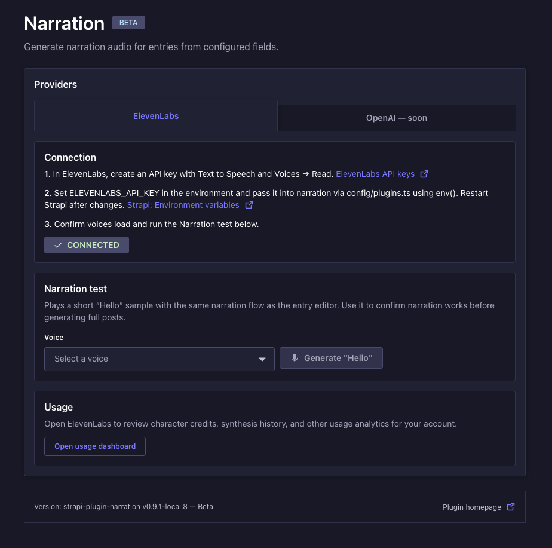
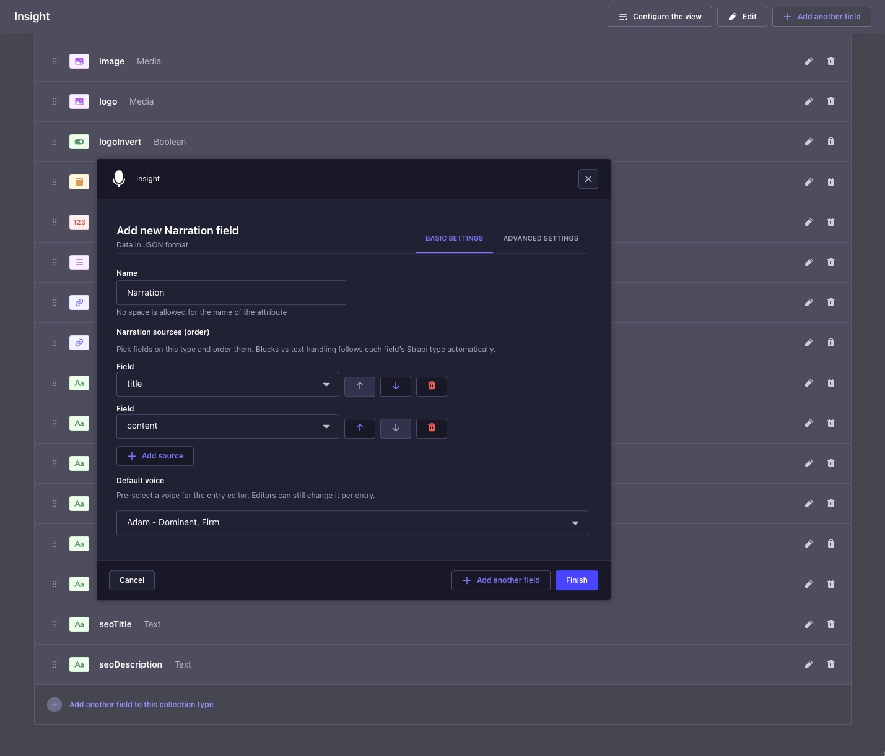
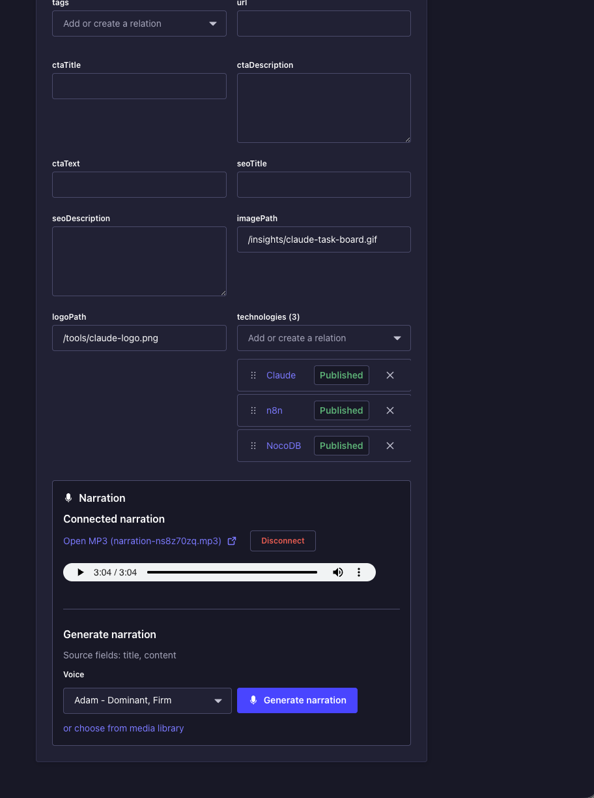

<p align="center">
  
</p>

# Narration for Strapi 5

[](https://www.npmjs.com/package/strapi-plugin-narration)
[](#beta-status)
[](./LICENSE)
[](https://github.com/IBSolutions-dev/strapi-plugin-narration/actions/workflows/ci.yml?query=branch%3Amain+event%3Apush)

**Package:** [`strapi-plugin-narration`](https://www.npmjs.com/package/strapi-plugin-narration) · **Repository:** [github.com/IBSolutions-dev/strapi-plugin-narration](https://github.com/IBSolutions-dev/strapi-plugin-narration)

Add a **Generate narration** button to any Strapi entry. Pick a voice, click once, and the plugin turns the entry's text into an MP3, drops it into the **Media Library**, and remembers which voice and audio file belong to that entry.

Useful for podcasts, blog audio summaries, accessibility narration, audio descriptions for visitors who prefer to listen — anywhere you want hands-free reading without exporting and re-uploading manually.

<a id="beta-status"></a>

> **Beta:** This plugin is in **public beta** and still **being tested** ahead of a stable **`1.0.0`** release.

---

## What it looks like

**Plugin home** — Settings → Plugins → **Narration**: connect ElevenLabs, run a quick TTS test, and open usage analytics.

<p align="center">
  
</p>

**Configure the narration field** — Content-Type Builder **Basic settings**: field name, **Narration sources** order, and **Default voice**.

<p align="center">
  
</p>

**Generate narration** — On an entry: pick a voice (or keep the default), then **Generate narration**; playback and disconnect controls appear after audio is linked.

<p align="center">
  
</p>

---

## What you'll need

| Requirement        | Notes                                                            |
| ------------------ | ---------------------------------------------------------------- |
| Strapi             | **v5** (`^5.0.0`)                                                |
| Node.js            | `>=20.0.0 <=24.x.x`                                              |
| ElevenLabs account | Free tier is fine for testing; a paid plan for production volume |

You will create one **ElevenLabs API key** during installation. Plan for about 5 minutes total.

---

## Install

The four steps below are in the order you should do them. Don't skip ahead — step 3 needs the key from step 1.

### 1. Create an ElevenLabs API key

1. Go to [ElevenLabs → Developers → API keys](https://elevenlabs.io/app/developers/api-keys).
2. Click **Create API key**.
3. Under **Access**, enable **both**:
   - **Text to Speech** — needed to generate audio.
   - **Voices → Read** — needed to list voices in the admin UI.
4. Copy the key somewhere safe. You'll paste it into `.env` in step 3.

### 2. Install the package

In your Strapi project folder, run:

```bash
npm install strapi-plugin-narration@0.9.0
```

> **Beta:** during the `0.x` series, install an **exact** version (no `^`) and re-read [`CHANGELOG.md`](./CHANGELOG.md) before each upgrade — minor bumps may include intentional breaking changes. After `1.0.0` lands you can switch to a normal caret range.
>
> **Peer deps:** `@strapi/design-system`, `@strapi/icons`, `react-intl`, and `yup` must resolve from **your Strapi version** — a normal `@strapi/strapi` install already satisfies them (`npm ls @strapi/design-system`). Installing a mismatched standalone copy alongside the plugin risks duplicate stacks and runtime errors such as **`useContext` on null** when opening Content Manager entries.

### 3. Wire it into Strapi

Open (or create) `config/plugins.ts` in your Strapi project and add the `narration` block:

```typescript
export default ({ env }) => ({
  narration: {
    enabled: true,
    config: {
      apiKey: env("ELEVENLABS_API_KEY", ""),
      modelId: env("ELEVENLABS_MODEL_ID", "eleven_multilingual_v2"),
    },
  },
});
```

> Using JavaScript instead of TypeScript? The same content works in `config/plugins.js` — drop the `: ` after `env`.

Then add the API key from step 1 to your project's `.env` file:

```bash
ELEVENLABS_API_KEY=sk_paste_your_key_here
```

### 4. Rebuild the admin and start Strapi

```bash
npm run build
npm run develop
```

Open the admin and go to **Settings → Plugins**. You should see **Narration** in the list. If you do, you're done — the plugin is installed.

---

## Use it on a content type

1. In the admin, open **Content-Type Builder** and pick (or create) the content type you want to narrate — for example, an `Article` with a `title` and a `content` field.
2. On that same content type, click **Add another field** → **Custom fields** → **Narration**. Name the new field `narration` (or anything you like) and configure it:
   - **Narration sources** — the fields the plugin should read from, in the order they should be spoken.
   - **Default voice (required)** — pick once in CTB; that voice appears in every entry editor for this field until an author selects a different voice (stored on the entry). You must configure it before saving the content type.
   - **Pause between narration sources** _(optional, under Speech synthesis)_ — adds extra silence **between each source** in the synthesized text (via an SSML `<break>`), up to 3 seconds. Use **0** for the previous behaviour (`\n\n` only). Behaviour depends on your ElevenLabs TTS model.
   - **Strip text between custom delimiters** _(optional, under blocks filter)_ — add one or more **start tag** / **end tag** pairs. For each pair, narration removes the region from the first start through the matching end (**including those tags**) before TTS, and repeats until no match. Rows run **in order** — configure start `{{component:` and end `}}` to drop manual component shortcodes such as `{{component:hr}}`. Strapi Blocks use structured JSON `type`s in the REST payload; delimiter stripping applies to **literal text** in paragraphs.
3. Save the content type. Strapi will rebuild the admin.
4. Open or create an entry, **save it once** so the document exists in the database, then click **Generate narration**. An MP3 will land in your Media Library, and the field will remember which voice produced it.

---

## Using narration on your frontend (REST)

Headless apps read the **same narration field** you defined in Content-Type Builder. Its **API name matches the attribute name** (including capitalization), so if you named it `Narration` in CTB, the JSON uses `Narration`, not `narration`.

**Stored shape** after generation (plain JSON):

```json
{ "voiceId": "…", "audioFileId": 42 }
```

- **`audioFileId`** — Media Library file id for the MP3; use this to build playback URLs or download links.
- **`voiceId`** — ElevenLabs voice used for that clip (informational).

**Resolve a public MP3 URL** — call Strapi Upload’s file-by-id endpoint, then prepend your Strapi origin to the relative `url` field:

```javascript
/**
 * @param {string} strapiOrigin  e.g. "https://cms.example.com" (no trailing slash)
 * @param {string|null} bearerToken  API token when the Upload API is restricted
 * @param {unknown} narrationField rest field value (`Narration`, `narration`, …)
 */
async function resolveNarrationAudioUrl(strapiOrigin, bearerToken, narrationField) {
  let obj = narrationField;
  if (typeof obj === "string") {
    try {
      obj = JSON.parse(obj);
    } catch {
      return null;
    }
  }
  if (!obj || typeof obj !== "object") return null;
  const rawId = /** @type {{ audioFileId?: unknown }} */ (obj).audioFileId;
  const id =
    typeof rawId === "number"
      ? rawId
      : typeof rawId === "string" && /^\d+$/.test(rawId.trim())
        ? Number(rawId.trim())
        : NaN;
  if (!Number.isFinite(id)) return null;

  const headers = bearerToken ? { Authorization: `Bearer ${bearerToken}` } : {};
  const res = await fetch(`${strapiOrigin}/api/upload/files/${id}`, {
    headers,
  });
  if (!res.ok) return null;

  const body = await res.json();
  const rel = body?.url ?? body?.data?.url;
  if (typeof rel !== "string" || !rel.length) return null;
  return new URL(rel, strapiOrigin).href;
}

// Example: fetch one entry — replace `articles` / `YOUR_FIELD_NAME` / slug with yours.
// Strapi 5 Draft & Publish: add `status=published` when you fetch from the Content API.
// If your REST payload nests fields under `attributes`, read `entry.attributes.YOUR_FIELD_NAME`.
const ORIGIN = "https://cms.example.com";
const TOKEN = process.env.STRAPI_READ_TOKEN ?? ""; // token with Upload `findOne` access if endpoints are restricted

const { data } = await fetch(`${ORIGIN}/api/articles?filters[slug][$eq]=my-post&status=published`, {
  headers: TOKEN ? { Authorization: `Bearer ${TOKEN}` } : {},
}).then((r) => r.json());

const entry = data?.[0];
const narration = entry?.YOUR_FIELD_NAME ?? entry?.attributes?.YOUR_FIELD_NAME;
const mp3 = await resolveNarrationAudioUrl(ORIGIN, TOKEN, narration);
if (mp3) {
  // <audio src={mp3} controls /> or pass to your player component
  console.log(mp3);
}
```

Grant your **Content API** token permission to **`find` / `findOne` on `upload`** (file metadata) if Strapi returns **403** on `/api/upload/files/:id`. If the file is **publicly** readable, you can sometimes skip the upload call and point `<audio>` at `STRAPI_URL + url` once you have it from a populated response — the pattern above works without relying on `populate` quirks for custom fields.

---

## Advanced configuration

The minimum config in step 3 of Install is enough for most projects. If you need to tune behaviour, the full set of options lives in `config/plugins.ts`:

```typescript
narration: {
  enabled: true,
  config: {
    apiKey: "",
    modelId: "eleven_multilingual_v2",
    /** Hard cap on characters per single generation. */
    maxChars: 50000,
    /** Skip real ElevenLabs calls; useful for staging. See "Dry-run mode" below. */
    ttsDryRun: false,
    /** Timeout for one ElevenLabs TTS request. */
    ttsRequestTimeoutMs: 8 * 60 * 1000,
    /**
     * Which provider tabs appear on the plugin home page.
     * Omit or set to [] to show all known providers.
     * Example: ["elevenlabs"] hides the OpenAI placeholder tab.
     */
    adminProviderTabs: ["elevenlabs", "openai"],
    /** Static voice list, for offline or locked-down environments. */
    voiceCatalog: [],
    /** How long to cache the live ElevenLabs voice list. 0 = always refetch. */
    voicesListCacheTtlMs: 24 * 60 * 60 * 1000,
  },
},
```

### Dry-run mode (no ElevenLabs charge)

For staging environments where you want to test the full pipeline without burning ElevenLabs credits, add this to your `.env`:

```bash
STRAPI_NARRATION_TTS_DRY_RUN=true
```

Generations now produce a **placeholder MP3** instead of calling ElevenLabs.

| `.env` value              | What happens                              |
| ------------------------- | ----------------------------------------- |
| `true`, `1`, `yes`, `on`  | Placeholder MP3, **no** TTS request       |
| `0`, `false`, `no`, `off` | Real TTS (needs your API key)             |
| not set                   | Uses `config.ttsDryRun` (default `false`) |

Strapi logs a warning at startup whenever dry-run mode is active so you don't forget to turn it off in production.

---

## Troubleshooting

### The **Generate narration** button doesn't appear

- Did you rebuild the admin after installing? `npm run build`, then restart Strapi.
- Did you save the entry first? The button needs a saved document.
- Are your **Narration sources** configured to point at fields that actually exist on this content type?

### "ElevenLabs network error" on IPv6-first networks

On some networks, `api.elevenlabs.io` resolves to IPv6 first but your machine or VPN can't reach IPv6. You'll see undici errors like `UND_ERR_SOCKET` or "other side closed".

Fix: set this in your `.env`:

```bash
ELEVENLABS_DNS_IPV4_FIRST=1
```

This switches Node's DNS resolution to prefer IPv4 for the entire process.

### CTB shows a "Visibility condition" section for the Narration field

Strapi's Content-Type Builder renders that for every custom field. The plugin does not read it. You can ignore it for the narration field.

### Narration works in admin but missing on the site / Content API

- If your content type uses **Draft & Publish**, generate and **save**, then click **Publish** (or publish again after changes). Publication updates the live document your website or **`status=published`** REST queries use; a **draft** may still omit or lag the narration field until you publish.
- Confirm your frontend asks for **published** entries (see the **`status`** pattern in [**Using narration on your frontend (REST)**](#using-narration-on-your-frontend-rest) above).

---

## More documentation

- [Roadmap](./ROADMAP.md) — planned directions and backlog (informal).
- [Security policy](./SECURITY.md) — how to report vulnerabilities.
- [Changelog](./CHANGELOG.md) — what changed and when.
- [Contributing](./CONTRIBUTING.md) — for pull requests and bug reports.
- [Code of Conduct](./CODE_OF_CONDUCT.md) — repository behaviour.

---

## License

MIT — see [LICENSE](./LICENSE).

---

Built and maintained by [IB Solutions](https://ibsolutions.dev) — a systems integration consultancy.
